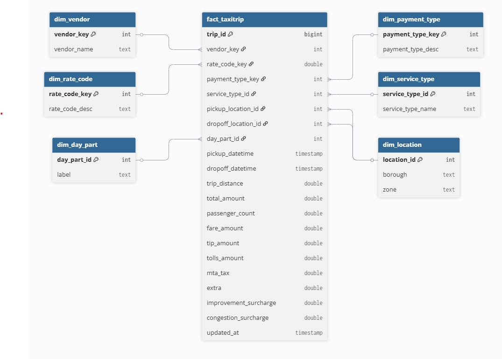

# 🚕 NYC Taxi Trip Data Engineering Pipeline

An end-to-end Data Engineering project that builds a scalable, modular data pipeline for NYC Yellow and Green Taxi trip data. The system support both **batch** and **streaming** ingestion, applies transformations with **Spark** and **dbt**, stores results in a **Data Lake + Data Warehouse**, and visualize sample insights with **Superset**.

🚧 **This project is still under active development. Features and structure may change.**

## 📖 Table of Contents

1. [📌 Project Overview](#-project-overview)
2. [🧬 Data Flow Architecture](#-data-flow-architecture)
3. [📁 Project Folder Structure](#-project-folder-structure)
4. [🧪 Get Started](#-get-started)
   - [⚙️ Batch Processing](#️-batch-processing)
   - [📡 Streaming Processing](#-streaming-processing)
   - [🔁 dbt for Data Warehouse](#-dbt-for-data-warehouse)
5. [⏰ Airflow DAGs Orchestration](#-airflow-dags-orchestration)
6. [📊 BI Visualization with Superset](#-bi-visualization-with-superset)
7. [📚 References](#-references)

## 📌 Project Overview

This project simulates a real-world Data Engineering pipeline for NYC taxi trips using open-source tools. It demonstrates key data engineering concepts end-to-end, including:

- Batch processing with Parquet files
- Streaming ingestion using Kafka and Debezium (CDC)
- Data Lake architecture with raw / processed / sandbox zones
- ETL with Spark and Delta Lake
- Data transformation with dbt
- Pipeline orchestration using Apache Airflow
- Business Intelligence dashboarding using Superset

### 📦 Tech Stack

- **Language**: Python 3.9.7
- **Batch Processing**: Apache Spark 3.5.6, Delta Lake
- **Streaming Ingestion**: Apache Kafka, Debezium (CDC), Spark Structured Streaming
- **Orchestration**: Apache Airflow
- **Object Storage**: MinIO (S3-compatible)
- **Data Lake Format**: Delta Lake + Hive Metastore
- **Data Warehouse**: PostgreSQL (with staging and production schemas)
- **Transformation Layer**: dbt (Data Build Tool)
- **BI & Visualization**: Apache Superset
- **Containerization**: Docker

## 🧬 Data Flow Architecture


<p align="center">
    <em>Data Flow Architecture</em>
</p>

The architecture includes:

- Batch ingestion from NYC Trip Record Data `.parquet` files
- Streaming ingestion via CDC (Debezium -> Kafka -> Spark Streaming)
- Spark batch jobs to clean and load data from raw -> processed -> sandbox, processed -> staging (PostgreSQL Datawarehouse)
- dbt for transforming staging data to production (star schema)
- Superset for dashboarding

## 📁 Project Folder Structure

```bash
.
    ├── airflow/                                    /* airflow folder /*
    ├── configs/
    │   └── datalake.yaml                           /* config of MinIO /*
    ├── data/                                       /* contain dataset /*
    │   ├── 2023/
    │   ├── 2024/
    │   └── download_data.py
    ├── dbt_tripdata/                               /* dbt folder for transformation datawarehouse /*
    ├── debezium/
    │    └── configs/
    │       └──  taxi-nyc-cdc-json                  /* config file to setup connection debezium cdc with kafka /*
    ├── docker/
    │   ├── docker-compose.yaml
    │   ├── airflow-docker-compose.yaml
    │   ├── postgres-docker-compose.yaml
    │   ├── stream-docker-compose.yaml
    │   └── superset-docker-compose.yaml
    ├── pipelines/                                  /* spark jobs for pipeline /*
    │   ├── data/
    │       └── taxi_zone_lookup.csv
    │   ├── datalake_to_dw/
    │       └── processed_to_staging.py
    │   ├── delta/
    │       └── convert_to_delta.py
    │   ├── ingest/
    │       └── ingest_to_raw.py
    │   └── transform/
    │       └── transform_data.py
    ├── scripts/
    │   ├── create_cdcsource_table_pg.py
    │   ├── create_schema_postgres.py
    │   ├── create_staging_table_pg.py
    │   └── insert_to_cdc_source.py
    ├── imgs/
    ├── jars/                                       /* JAR files for Spark*/
    ├── streaming_processing/
    │    └── streaming_to_datalake.py               /* read data streaming from kafka and push into raw zone MinIO */
    ├── utils/
    │    ├── postgresql_client.py                   /* PostgreSQL Client: create connect, execute query, get columns in bucket /*
    │    ├── helper.py
    │    └── minio_utils.py
    ├── .env
    ├── .gitignore
    ├── README.md
    └── requirements.txt
```

## 🧪 Get Started

### 🔧 Setup & Environment

1.  **Clone the repository**:

    ```bash
    git clone https://github.com/rooniac/nyc-taxi-data-engineering.git
    cd nyc-taxi-data-engineering
    ```

2.  **Install dependencies**:

    ```bash
    python -m venv venv
    source venv/bin/activate  # Windows: venv\Scripts\activate
    pip install -r requirements.txt
    ```

3.  **Setup `.env` file**:
    Create `.env` base on your infomation that you set in docker (PostgreSQL, Minio, Kafka, ...)

### ⚙️ Batch Processing

1.  **Download TLC parquet files**:

    You should change variables in `data/download_data.py` to download any month or year data that you want to test.

    ```bash
    python data/download_data.py
    ```

2.  **Run MinIO with docker**:

    ```bash
    docker compose -f docker/docker-compose.yaml up -d
    ```

    Now you can access `localhost:9001` and login to MinIO with your information in docker file.

3.  **Upload raw data to MinIO**:

    ```bash
    python pipelines/ingest/ingest_to_raw.py
    ```

4.  **Run batch transformation**:

    ```bash
    spark-submit pipelines/transform/transform_data.py
    ```

5.  **Convert to Delta format (Optional)** :

    ```bash
    spark-submit pipelines/delta/convert_to_delta.py
    ```

6.  **Run PostgreSQL with docker** :

    ```bash
    docker compose -f docker/postgres-docker-compose.yaml up -d
    ```

7.  **Create schemas and tables** :

    ```bash
    python scripts/create_schema_postgres.py
    python scripts/create_staging_table_pg.py
    ```

8.  **Load to PostgreSQL (staging)** :

    ```bash
    spark-submit pipelines/datalake_to_dw/processed_to_staging.py
    ```

### 📡 Streaming Processing

1.  **Start Kafka + Zookeeper + Debezium CDC with docker**:

    ```bash
    docker-compose -f docker/stream-docker-compose.yaml up -d
    ```

2.  **Create CDC source table and insert mock data**:

    ```bash
    python scripts/create_cdcsource_table_pg.py
    python scripts/insert_to_cdc_source.py
    ```

3.  **Register CDC connect with PostgreSQL cdc_source**:

    ```bash
    curl -X POST http://localhost:8083/connectors ^
    -H "Content-Type: application/json" ^
    -d "@debezium\configs\taxi_nyc_connector.json"
    ```

4.  **Start Spark Streaming job**:

    ```bash
    spark-submit streaming_processing/streaming_to_datalake.py
    ```

    After this, you can check raw/streaming in MinIO to see streaming data.

## 🔁 dbt for Data Warehouse

The final stage of the batch pipeline leverages **dbt (Data Build Tool)** to transform data in the `staging` schema of PostgreSQL into a clean, analytical **star-schema** model stored in the `production` schema.

1.  **Initialize dbt** (only required the first time):

    ```bash
    cd dbt_tripdata
    dbt deps
    ```

2.  **Run all dbt models and transformations:**:

    ```bash
    dbt run
    ```

    After the transformation completes successfully, you can connect to the PostgreSQL instance and query tables in the production schema. These tables are fully modeled and ready for analysis or visualization.

<p align="center">
  
  <br/>
  <em>Production star schema</em>
</p>

## ⏰ Airflow DAGs Orchestration

1.  **Start Airflow with Docker**:

    You have to keep MinIO, PostgreSQL docker running to use Airflow DAGs.

    ```bash
    docker-compose -f docker/airflow-docker-compose.yaml up -d
    ```

2.  **Airflow UI**:

    Once airflow is running, you can access `localhost:8080` and login with your information. After that, you have to register connections with MinIO and PostgreSQL.

3.  **Trigger DAGs**:

    In this project, the entire pipeline is orchestrated using **five modular Airflow DAGs**, each representing a critical stage in the data lifecycle. Together, they cover the full batch pipeline from raw ingestion to production-ready warehouse tables:

    - **DAG 1 – `nyc_taxi_ingest`**: Downloads NYC TLC data and uploads it to the raw zone in MinIO.
    - **DAG 2 – `nyc_taxi_transform`**: Cleans and standardizes raw data, writing to the processed zone.
    - **DAG 3 – `nyc_taxi_convert_delta`**: Converts processed Parquet data into Delta Lake format for sandbox querying (optional).
    - **DAG 4 – `nyc_taxi_staging`**: Loads processed data into the staging schema of the PostgreSQL warehouse.
    - **DAG 5 – `nyc_taxi_production`**: Runs dbt models to transform staging tables into a star-schema production layer.

    You can trigger these DAGs in sequence to execute the full batch pipeline and observe how data flows through each stage of the architecture.


<p align="center">
  <em>Airflow DAGs</em>
</p>

## 📊 BI Visualization with Superset

If you would like to see the outcome of pipeline, you can access to PostgreSQL and query `production`. However, if you want to visualize the final data we got at `production`, you can use any BI tool you want. In this project, I use Apache Superset to visualize sample data - the first 10 days of 2025 Feb.


<p align="center">
  <em>Superset Dashboard for sample data from 01/02/2025 to 10/02/2025</em>
</p>

## 📚 References

- **NYC TLC Trip Record Data**  
  Open dataset provided by the New York City Taxi and Limousine Commission (TLC), containing detailed trip records for Yellow and Green taxis.  
  📎 Source: [TLC Trip Record Data](https://www.nyc.gov/site/tlc/about/tlc-trip-record-data.page)
